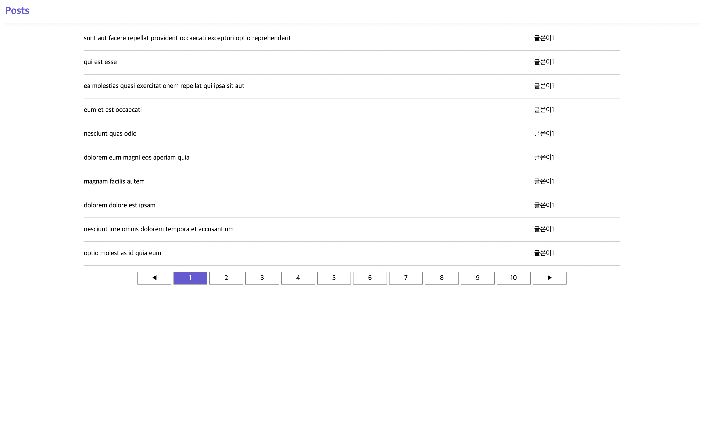
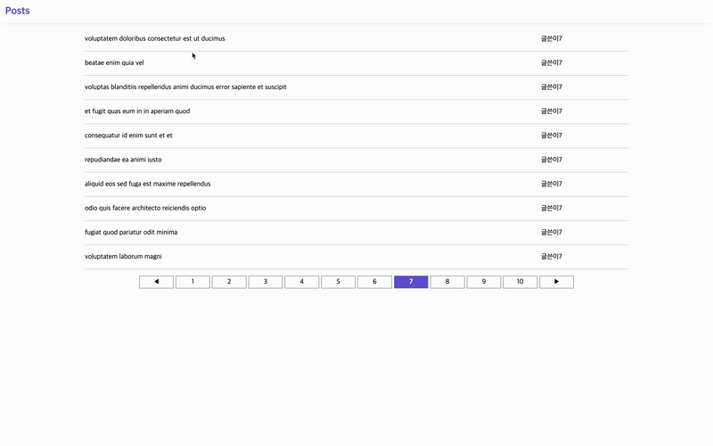
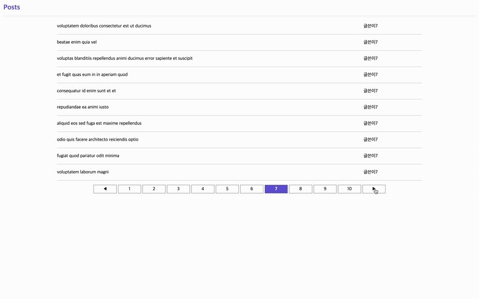

### 배포 링크

### 사용한 스택 목록

- React
- JavaScript
- Styled-Components

### 구현한 기능 목록 (Software Requirement Specification)

  
 게시물 리스트 

      

---

  
 게시물 상세 페이지 

      

---

  
 페이지네이션 

      

---

  
 반응형 

      

---

### 성능 최적화에 대해서 고민하고 개선한 방법

  
 서버에 요청하는 횟수 줄이기 

  <ol>
    <li>처음 앱을 시작할 때 posts와 comments 데이터 받아오기</li>
    <li>filter를 이용하여 post 컴포넌트와 detail 컴포넌트의 props로 데이터 보내기</li>
  </ol>
  

    <strong>결론</strong>
    위의 과정 전에는 사용자가 post를 클릭 할 때마다 서버로 요청을 보냈으나
    이 과정 후에는 서버에 요청하는 횟수가 2번으로 고정됨 (posts, comments)
  

---

### 추가 구현 사항에 대한 구현 방법과 설명

  
 Pagination 

  <a href="https://codingbe.github.io/2022/08/04/%EA%B5%AC%EA%B8%80%EC%9D%98-%ED%8E%98%EC%9D%B4%EC%A7%80%EB%84%A4%EC%9D%B4%EC%85%98%EC%B2%98%EB%9F%BC-%EA%B5%AC%ED%98%84%ED%95%B4%EB%B3%B4%EA%B8%B0/" target="_blank">링크</a>

---

  
 게시물 상세페이지를 모달로 만들기 

  <a href="https://codingbe.github.io/2022/08/05/%EA%B2%8C%EC%8B%9C%EB%AC%BC-%EC%83%81%EC%84%B8-%ED%8E%98%EC%9D%B4%EC%A7%80-%EB%AA%A8%EB%8B%AC%EB%8A%90%EB%82%8C-%EB%82%B4%EA%B8%B0/" target="_blank">링크</a>

---
